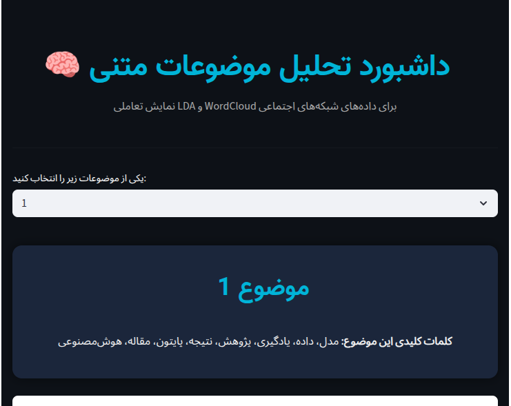
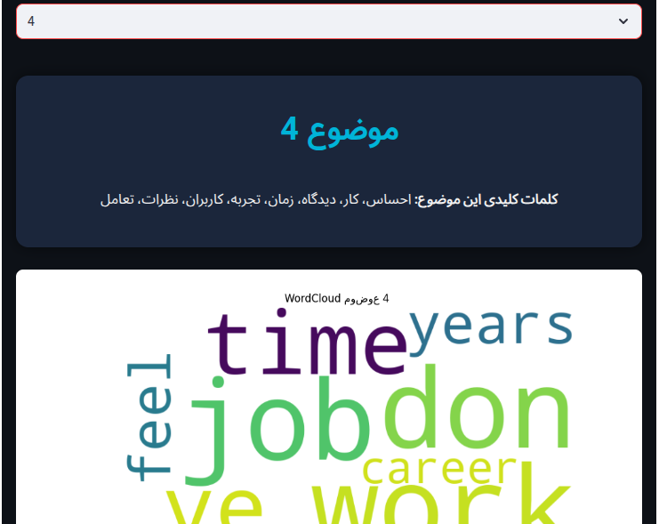

# 🧠 Social Media Analyzer

### Multi‑Language Topic Modeling & Sentiment Dashboard

This project provides an interactive **social media analysis** workflow using **Natural Language Processing (NLP)** and **Streamlit Dashboard**.  
It cleans, models, and visualizes online conversations with **LDA Topic Modeling** and sentiment insights.

---

## 🚀 Features

- Automatic text cleaning and preprocessing (stopwords, stemming, emoji removal)
- **LDA topic modeling** (5 discovered topics)
- Wordcloud generation for each topic
- Interactive **Streamlit dashboard** (Dark Mode + Persian font support)
- RTL layout for Farsi visualization
- Ready to deploy via GitHub or Streamlit Cloud

---

## 🧩 Project Structure
social_media_analyzer/

├── app.py # Streamlit dashboard (Dark mode, RTL, Vazir font)

├── src/

│ ├── topic_modeler.py # LDA model training and wordcloud generation

│ └── preprocess.py # Text preprocessing pipeline

├── data/

│ ├── wordcloud_topic_1.png

│ ├── wordcloud_topic_2.png

│ ├── wordcloud_topic_3.png

│ ├── wordcloud_topic_4.png

│ ├── wordcloud_topic_5.png

│ ├── dashboard_overview.png

│ └── topic3_wordcloud.png

├── requirements.txt

└── README.md

---

## 🖥️ Streamlit Dashboard Preview

### Overview


### Example Topic Wordcloud


---

## ⚙️ Installation & Run

### 1️⃣ Clone Repository
```bash
git clone https://github.com/shahpari2kht/social_media_analyzer.git
cd social_media_analyzer
2️⃣ Create Virtual Environment
python3 -m venv venv
source venv/bin/activate
3️⃣ Install Requirements
pip install -r requirements.txt
4️⃣ Run Analysis and Dashboard
python3 src/topic_modeler.py
streamlit run app.py

📦 Requirements
Core Dependencies:

streamlit
pandas
numpy
scikit-learn
gensim
matplotlib
wordcloud
🧑‍💻 Author
Parisa Mohammadzadeh

Data Science Enthusiast & NLP Learner

📍 Ilam, Iran

📂 GitHub: @shahpari2kht

✉️ Email: shahpari2kht@gmail.com

🌍 تحلیل شبکه‌های اجتماعی
این پروژه یک ابزار تحلیلی برای پردازش و شناسایی موضوعات در متون شبکه‌های اجتماعی است.

مدل LDA به‌صورت خودکار پنج موضوع اصلی را شناسایی کرده و نقشه‌های کلمه‌ای (WordClouds) و داشبورد تعاملی تولید می‌کند.

🎛️ امکانات
پاک‌سازی و پیش‌پردازش خودکار متن
مدل‌سازی موضوعی با LDA
تولید نقشهٔ کلمه‌ای برای هر موضوع
داشبورد Streamlit با حالت تیره و فونت فارسی وصاف
پشتیبانی کامل از چیدمان راست‌به‌چپ (RTL) در رابط کاربری
🗂️ ساختار پروژه
فایل‌ها در پوشه‌ها به شکل زیر سازماندهی می‌شوند:

src/ شامل کدهای مربوط به پیش‌پردازش و مدل LDA
data/ شامل خروجی‌ها و تصاویر
app.py برای اجرای رابط کاربری Streamlit
⚙️ نحوه اجرا
کلون کردن پروژه از گیت‌هاب
اجرای مدل با topic_modeler.py
اجرای داشبورد با streamlit run app.py
مشاهده نتایج در محیط مرورگر
📸 پیش‌نمایش
نمای کلی داشبورد	نقشه کلمات یکی از موضوعات
	
مجوز و منبع
استفاده از این پروژه برای اهداف آموزشی و تحقیقاتی آزاد است.

کلیه کدها توسط پریسا محمدزاده توسعه داده شده‌اند.
